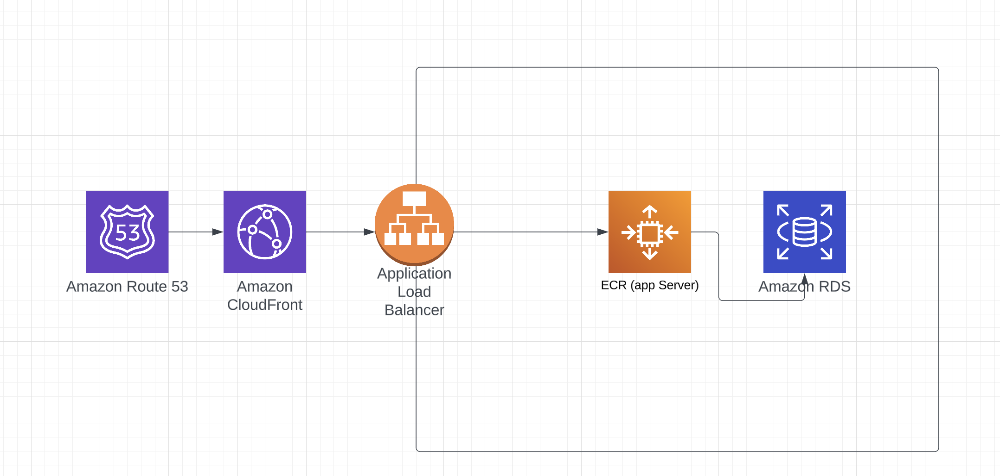

***Before running the application.
Please change the .env file with your database name and credentials

Produce a system diagram of your solution deployed to either AWS or GCP (it's not
required to support both cloud platforms).

 Write configuration scripts for building and no-downtime production deployment of this application, keeping in mind aspects that an SRE would have to consider.